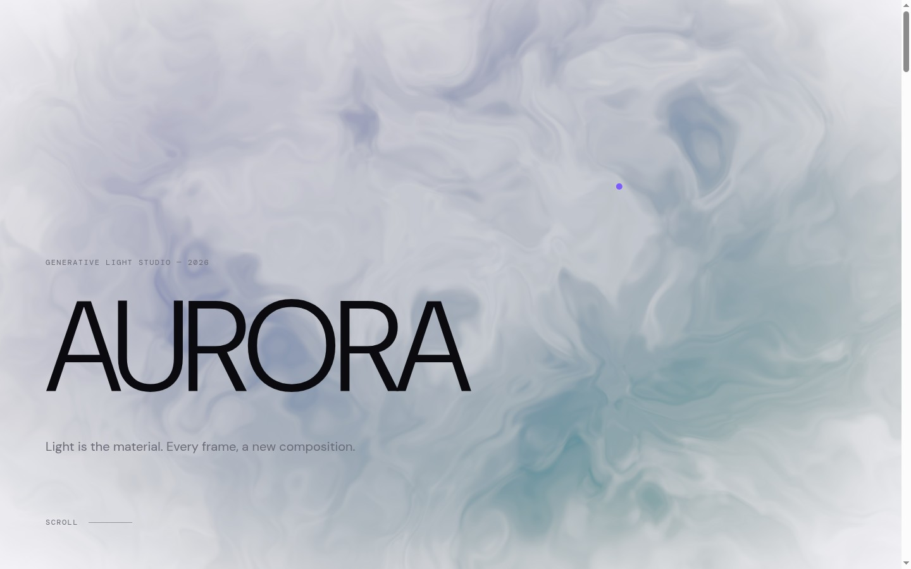

# AURORA

**Light is the material.** A generative-art studio landing page built as a pure interaction &
motion showcase — a light, kinetic counterpoint to the usual dark portfolio piece.



## What it is

A fictional generative-art studio site whose hero is a full-viewport **WebGL aurora**: a
domain-warped flow-field shader that bends and parts around the cursor like light in water,
rendered luminously on a near-white canvas. The rest of the page is choreographed motion —
oversized kinetic typography, a custom magnetic cursor, smooth scrolling, and a pinned
horizontal "Studies in Light" gallery.

## Highlights

- **Cursor-reactive aurora hero** — GLSL fbm + two-pass domain warping, additive-feel violet→teal
  ribbons on white, cursor velocity parts the field. (`react-three-fiber` + raw GLSL)
- **Custom magnetic cursor** — spring-followed dot that grows and inverts over interactive targets.
- **Kinetic typography** — clip-reveal wordmark, per-word manifesto stagger, scroll-driven motion.
- **Pinned horizontal gallery** — vertical scroll drives horizontal travel; collapses to a clean
  vertical stack on mobile.
- **Lenis smooth scroll** on a single shared RAF.
- **Accessible** — full `prefers-reduced-motion` path: instant reveals, native cursor, vertical layout.
- **60fps budget** — clamped DPR, off-screen render pause, reduced-motion shader idle.

## Stack

React 19 · Vite · three.js / @react-three/fiber · Framer Motion · Lenis

## Develop

```bash
npm install
npm run dev      # http://localhost:5173
npm run build    # static output in dist/
```

> On WSL2 (`/mnt/*`), native file-watch events don't fire — `vite.config.js` enables polling so
> HMR works. If a change ever seems to not apply, restart the dev server.

## Deploy

Static SPA — deploys to Vercel (or any static host) out of the box; `vercel.json` is included.

---

A design exploration. Built 2026.
